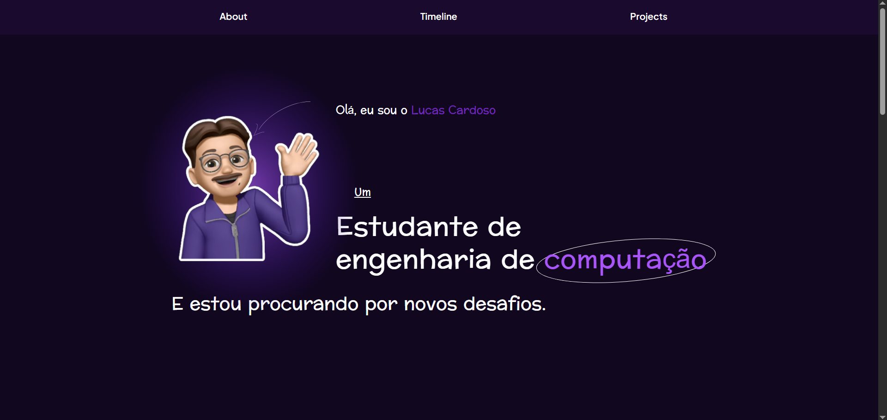
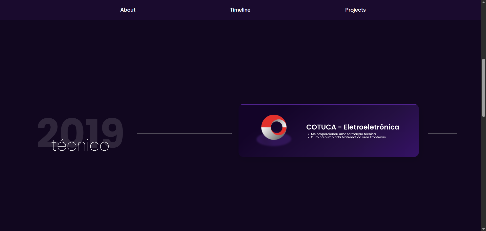
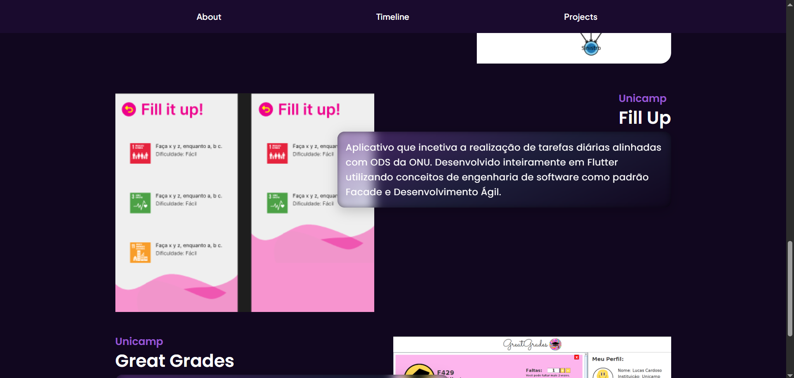

# Portfolio_Lucas_Cardoso

### Portfólio digital que desenvolvi para meu irmão usando apenas HTML, CSS e JS

## Screenshots





## Tecnologias

- HTML
- CSS
- JavaScript

## Funcionalidades

- Timeline interativa
- Recriação do liquid glass usando css nativo

## Como testar

Acesse o link do github pages do projeto: https://micardosofph.github.io/Portfolio_Lucas_Cardoso/

## Como executar

1. Clone o repositório

```bash
git clone https://github.com/micardosofph/Portfolio_Lucas_Cardoso
```

2. Abra index.html no navegador

## To Dos

- Deixar 100% responsivo em todos os dispositivos

